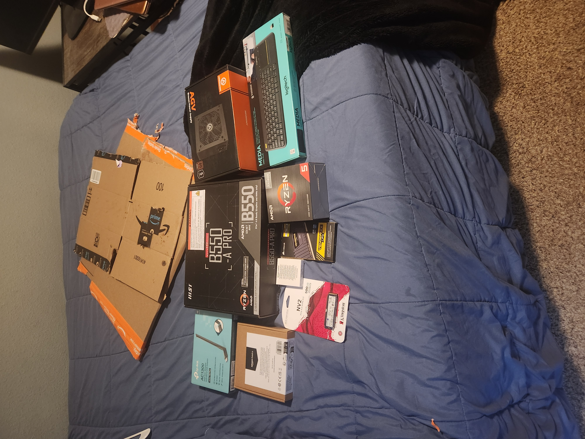
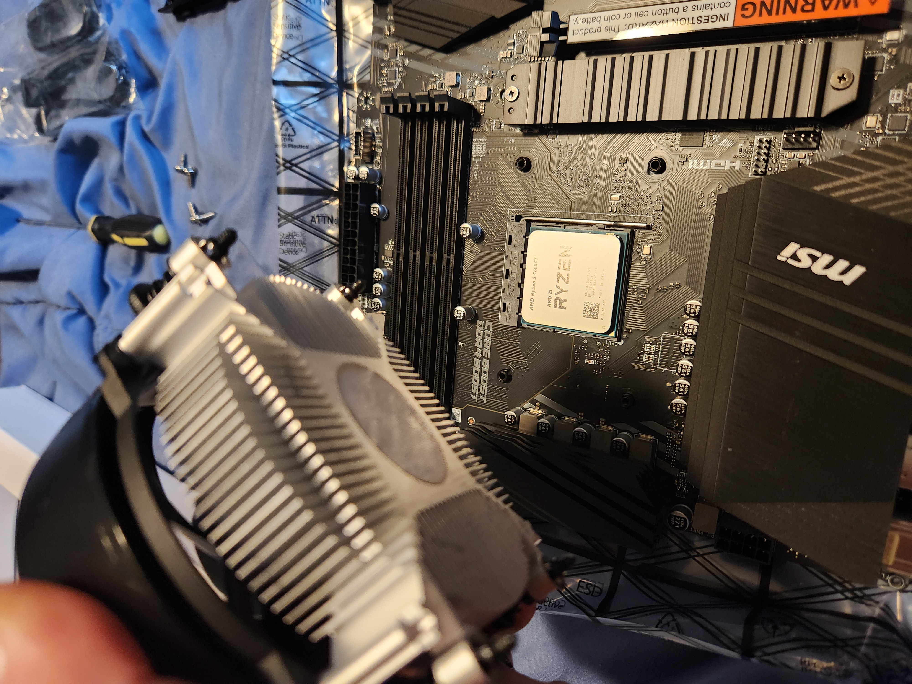
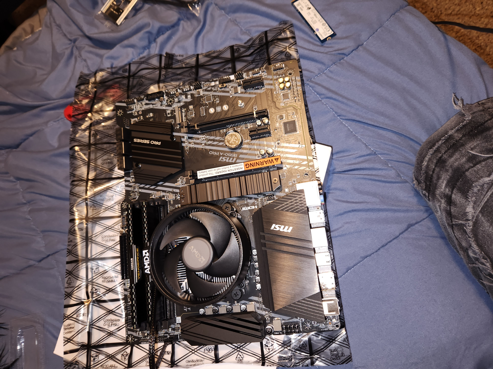
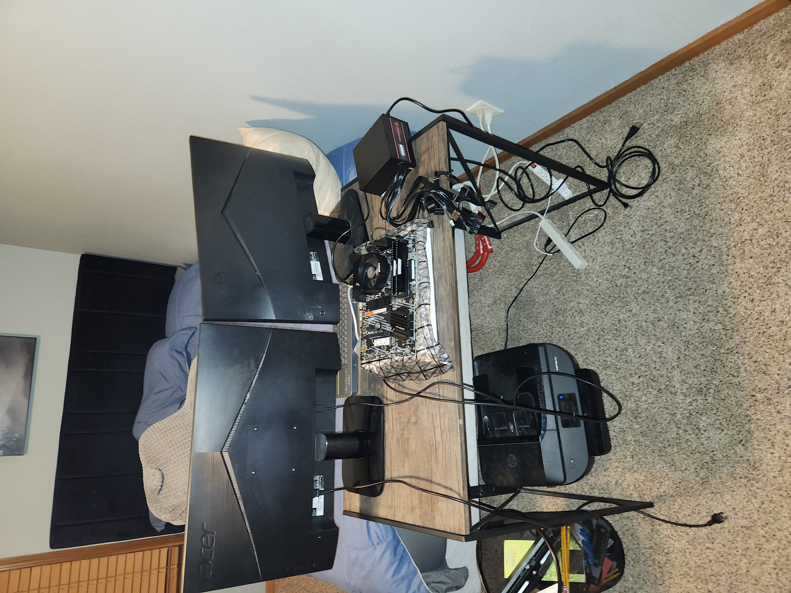
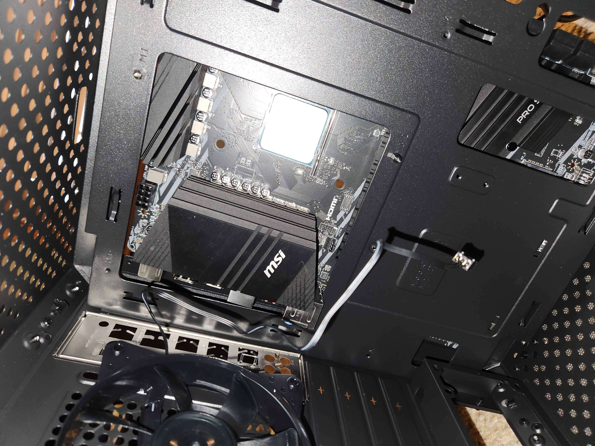
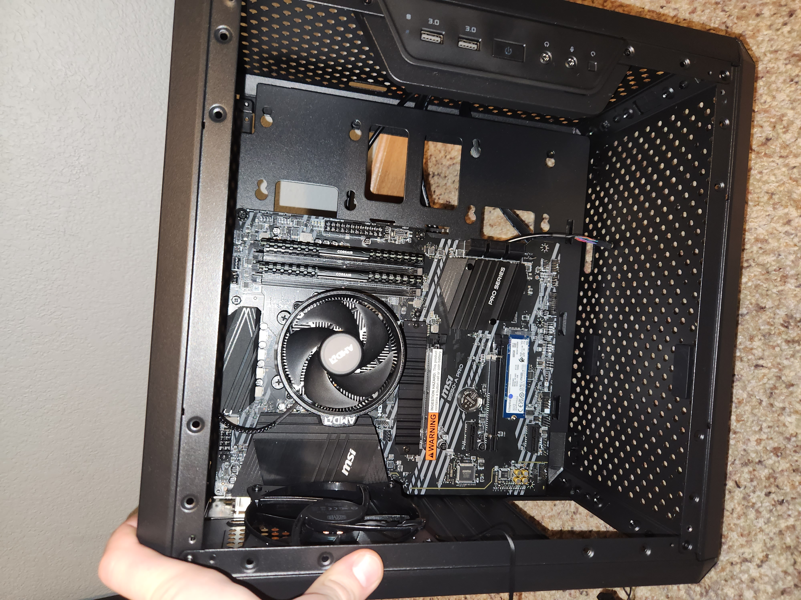
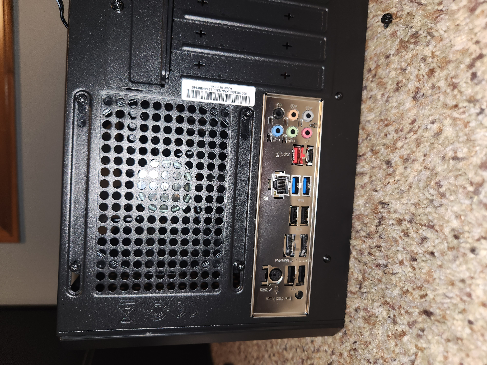
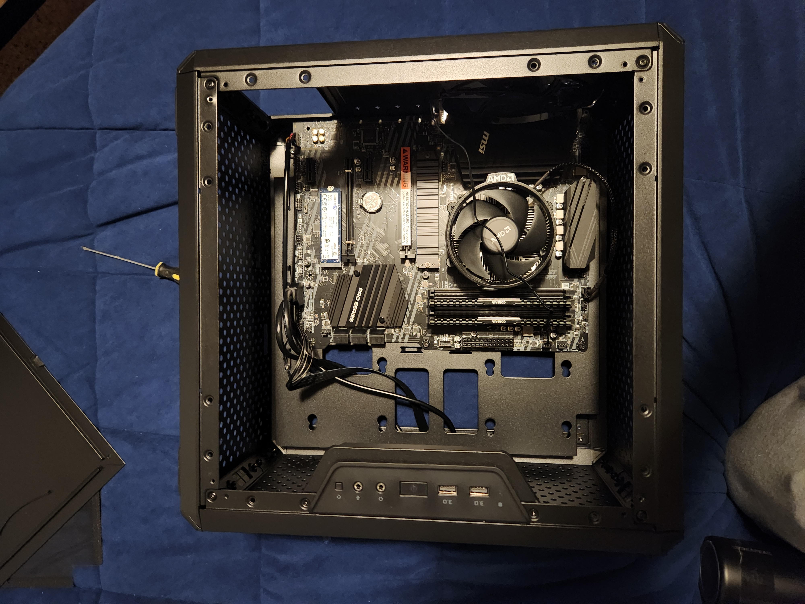

# 🚀 Kubuntu PC Build

A custom-built PC optimized for **Kubuntu 24.04 LTS**. This repository documents the **hardware selection, assembly process, driver installation, troubleshooting, and system optimizations** to create a smooth Linux experience. It serves as a reference for building a Linux workstation, with insights into **BIOS configuration, WiFi setup, and performance tuning**.

---

## 🔩 Hardware Components

| **Component**  | **Model/Brand**  |
|---------------|----------------|
| **CPU** | AMD Ryzen 5 5600GT |
| **Motherboard** | MSI B550-A PRO |
| **RAM** | Corsair Vengeance LPX DDR4 16GB (2x8GB) 3200MHz |
| **Storage** | Kingston NV2 500GB M.2 NVMe SSD |
| **Case** | Cooler Master MasterBox Q300L |
| **Power Supply** | ARESGAME 650W 80+ Bronze |
| **WiFi Adapter** | TP-Link USB AC1300 (Archer T3U Plus) |
| **Bluetooth Adapter** | TP-Link UB400 USB Bluetooth 4.0 |
| **Peripherals** | Logitech K400 Plus Wireless Keyboard |
| **Networking** | Amazon Basics Cat 6 Ethernet Cable |

---

## 🛠️ Build Process

### 📷 Hardware Assembly Process
Here are photos documenting the PC build process:










### 🔧 Assembling the Hardware
```
- Installed CPU, RAM, and SSD onto the motherboard.
- Mounted the motherboard inside the case and connected all components.
- Installed the power supply and routed cables for airflow optimization.
```

### 💿 Installing Kubuntu 24.04 LTS
```
- Created a bootable USB using Rufus (Windows) or `dd` (Linux).
- Installed Kubuntu and configured partitions for SSD optimization.
```

### 🖥️ Post-Installation Setup
✅ **WiFi & Bluetooth**: Installed drivers and configured connections.  
✅ **BIOS Configuration**: Enabled XMP for RAM, adjusted boot priorities.  
✅ **System Optimizations**: Tweaked power settings, installed essential software.  

---

## 🛠️ Troubleshooting & Fixes

| **Issue** | **Solution** |
|-----------|-------------|
| **WiFi Adapter Not Recognized?** | Installed `rtl88x2bu` driver from GitHub. |
| **No Display Output?** | Reset CMOS and ensured GPU (if applicable) was seated correctly. |
| **Slow Boot Times?** | Disabled unneeded services using `systemctl`. |

---

## ⚡ System Optimizations

### 🚀 Speed up boot times
```bash
sudo systemctl disable NetworkManager-wait-online.service
```

### 🔄 Enable TRIM for SSD longevity
```bash
sudo systemctl enable fstrim.timer
```

---

## 🚀 Future Upgrades

- 🎮 **Add a dedicated GPU** for enhanced performance.
- 💾 **Expand storage** with an additional SSD.

---

## 📌 Why This Project Stands Out:

✔️ Showcases **hardware assembly & Linux system setup**  
✔️ Demonstrates **troubleshooting & driver installation**  
✔️ Optimized for **performance, security, and usability**  

This project highlights my ability to **build, configure, and optimize Linux systems**, making me a great fit for IT, cybersecurity, and system administration roles.

---

### 🛠 Maintainer: Logan Lapierre
📌 **GitHub:** [@lupenox](https://github.com/lupenox)

